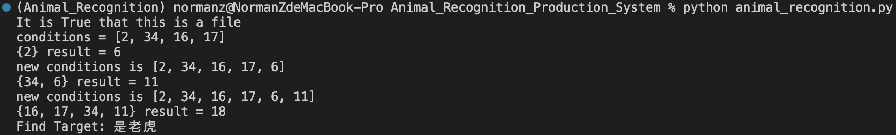
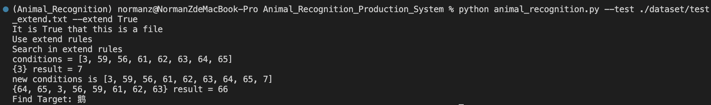

# Animal_Recognition_Production_System

### Recognize animal species by description based on Dynamic rules and database.

This project originates from [the repository where I restore my homework for Intelligent System](https://github.com/DuNGEOnmassster/Intelligent_System_homework.git) as an independent project.

And here are examples for what it would look like if you run `animal_indentify.py` in terminal use testdata in [dataset](./dataset/)

without extend          |  with extend
:-------------------------:|:-------------------------:
  |  

Hopefully you will like it.

